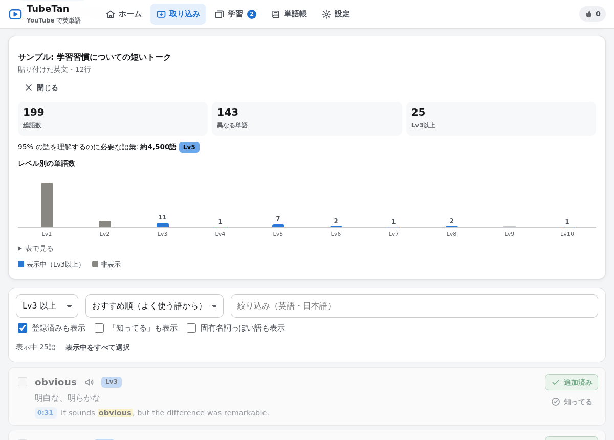
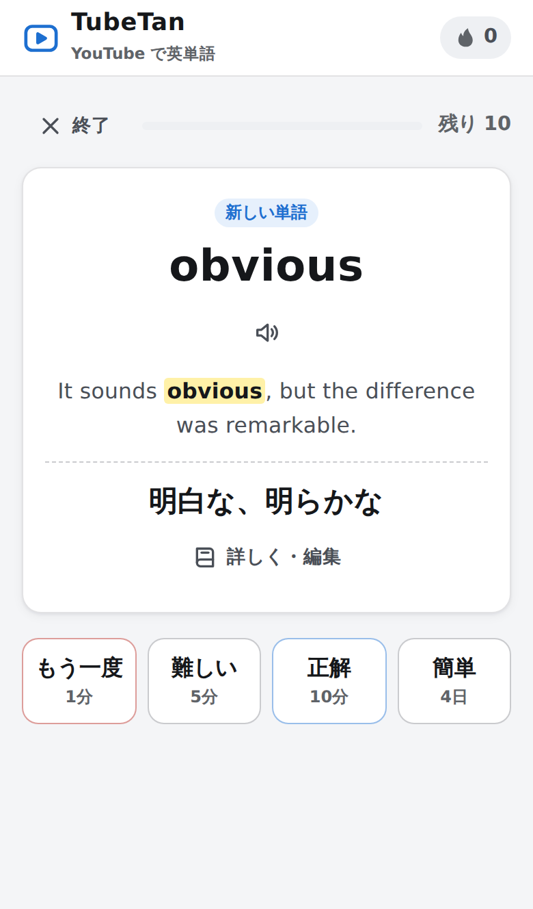

# TubeTan — YouTube で英単語

YouTube の動画の字幕から「あなたが知らなさそうな英単語」を自動で抜き出し、
動画の例文つきの単語帳にして、間隔反復（忘れかけた頃に出題）で覚えるアプリです。

<table><tr>
<td width="62%"></td>
<td></td>
</tr><tr><td>英文や動画の字幕から単語を抽出</td><td>毎日の復習（スマホ）</td></tr></table>

## できること

- **YouTube から単語を集める**: 動画の URL を貼るだけで英語字幕（自動生成字幕も可）を取得し、単語を原形にまとめて（studied → study など）難易度つきで一覧表示
  - その単語が出てくる**例文と時刻**を表示。▶ を押すとその場面から再生
  - 「Lv3 以上だけ」など、自分のレベルに合わせて易しい単語を隠せる
  - 動画の難しさ（95% を理解するのに必要な語彙数）とレベル別の単語数グラフ
  - 「知ってる」を押した単語は次から表示されない
- **英文・字幕の貼り付け**: YouTube の「文字起こし」のコピー、SRT / VTT 字幕、記事や歌詞などからも抽出
- **レベル別の単語**: 動画がなくても、Lv1〜10 の単語から選んで追加
- **単語帳**: 意味・メモの編集、動画の例文、英英辞典（Free Dictionary）、Weblio / 英辞郎 / Cambridge / YouGlish へのリンク
- **毎日の復習**: フラッシュカード（もう一度 / 難しい / 正解 / 簡単）で次の出題日を自動調整
- **クイズ**: 4択（英→日・日→英）、リスニング、スペリング、動画の例文の穴埋め
- **語彙力チェック**: 約60語から推定語彙数を出し、抽出レベルを自動設定
- 発音（ブラウザの読み上げ機能）、ダークモード、スマホ対応、学習記録のグラフ、連続学習日数
- バックアップ（JSON）・CSV 書き出し（Anki などに）

学習データはすべて**ブラウザの中（localStorage）**に保存され、どこにも送信されません。

## 使い方（かんたん3ステップ）

1. **Node.js をインストール**（バージョン 18 以上）: https://nodejs.org/ の「LTS」をダウンロードしてインストール
2. **このフォルダ（`vocab-app`）でサーバーを起動**
   - Windows: `start-windows.bat` をダブルクリック
   - Mac: `start-mac.command` をダブルクリック（初回は右クリック →「開く」）
   - ターミナルから: `cd vocab-app` → `node server.js`（または `npm start`）
3. ブラウザで **http://localhost:3000** を開く（`npm start` やダブルクリック起動なら自動で開きます）

あとは「取り込み」タブに YouTube の URL を貼って「単語を抽出」を押すだけです。

> 外部のライブラリは使っていないので `npm install` は不要です。

### スマホで使う

PC でサーバーを起動するときに `--lan` を付けると、同じ Wi-Fi のスマホからも開けます。

```sh
node server.js --lan
```

起動時に表示される `http://192.168.x.x:3000` のアドレスをスマホのブラウザで開いてください。
（学習データはブラウザごとに保存されます。PC とスマホで移したいときは、設定の「バックアップ」→「復元」を使います）

### 字幕がうまく取れないとき（yt-dlp のすすめ）

YouTube 側の仕組みが変わったり、短時間にたくさん取得したりすると「ボットでは？」と判定されて字幕を取れないことがあります。
そのときは [yt-dlp](https://github.com/yt-dlp/yt-dlp#installation) をインストールしておくと、サーバーが自動で yt-dlp を使って取り直します。

| OS | インストール方法の例 |
|---|---|
| Windows | `winget install yt-dlp` |
| Mac | `brew install yt-dlp` |
| 共通（Python がある場合） | `pip install -U yt-dlp` |

インストール後、サーバーを起動し直してください。設定画面の「字幕サーバー」に yt-dlp のバージョンが表示されれば使える状態です。
yt-dlp は YouTube の変更に合わせて頻繁に更新されるので、うまくいかなくなったら `yt-dlp -U`（または `pip install -U yt-dlp`）で更新してください。
別の場所にある yt-dlp を使う場合は `YTDLP_PATH=/path/to/yt-dlp node server.js` のように指定できます。

その他の原因と対処:

| 表示 | 対処 |
|---|---|
| この動画には字幕がありません | 字幕のない動画は使えません。YouTube の検索で「フィルタ → 字幕」を選ぶと字幕つきの動画だけを探せます |
| 英語の字幕がありません | 英語で話している動画を選んでください |
| ボットでは？と判定されました | 少し時間をおく・別のネットワークで試す・yt-dlp を入れる。VPN やクラウドサーバーからだと起こりやすいです |
| アプリのサーバーに接続できませんでした | `node server.js` が起動しているか確認してください |

どうしても取れないときは、YouTube の動画ページで「文字起こしを表示」→ 全部選択してコピー →「英文・字幕を貼る」タブに貼り付けても同じように使えます（URL も入れておくと、例文から該当シーンへ飛べます）。

### サーバーなしで使う

`public/index.html` をブラウザで直接開いても、字幕の自動取得以外（貼り付けからの抽出・単語帳・復習・クイズ）は使えます。
GitHub Pages などに `public` フォルダを置いて使うこともできます（その場合も字幕は貼り付けで）。

## サーバーのオプション

| 指定 | 意味 |
|---|---|
| `--lan` | 同じネットワークの他の端末からも接続できるようにする |
| `--open` | 起動後にブラウザを開く |
| `PORT=8080` | ポート番号を変える（既定 3000。使用中なら自動で次の番号） |
| `YTDLP_PATH=...` | yt-dlp の場所 |
| `ALLOW_ORIGIN=https://…` | 別のサイトに置いた画面からこのサーバーを使う場合に許可するオリジン |

## しくみ

- **字幕の取得**（`lib/youtube.js`）: 動画ページから Innertube API キーを取り出し、YouTube の player API から字幕トラック一覧を取得して、英語（手動字幕優先・なければ自動生成）の字幕をダウンロードします。失敗したときは yt-dlp があればそれで取り直します。
- **単語の抽出**（`public/js/core.js`）: 字幕を単語に分け、変化形を原形にまとめ、固有名詞や `[Music]` などを除外。単語ごとに出現回数・最初の例文と時刻を記録します。
- **難易度**: 英語の単語頻度データ（wordfreq）から、変化形の頻度を原形に合算した「よく使われる順位」を出し、Lv1（〜1000位）〜 Lv10（14000位〜）に分けています。試験の公式な基準ではなく目安です。
- **復習の間隔**: SM-2 方式をもとにした間隔反復。新しい単語は 1分 → 10分 → 1日 … と、正解するたびに間隔が伸びます。21日以上空いた単語を「習得」としています。

## 開発者向け

```
vocab-app/
├── server.js            ローカルサーバー（静的ファイル + /api/transcript, /api/health）
├── lib/youtube.js       YouTube 字幕の取得
├── public/              画面（そのまま静的ホスティングも可）
│   ├── index.html
│   ├── css/style.css
│   ├── js/core.js       抽出・原形化・レベル・間隔反復（Node からも使える）
│   ├── js/store.js      データ保存（localStorage）
│   ├── js/ui.js         画面部品（シート、読み上げ、YouTube プレーヤー、グラフ）
│   ├── js/app.js        各画面
│   └── data/            辞書データ（自動生成）
├── tools/               辞書データの生成ツール
└── test/                テスト（node --test）
```

- テスト: `npm test`（Node.js 18 以上。外部ライブラリ不要）
- 辞書データの作り直し（通常は不要）:
  ```sh
  pip install wordfreq lemminflect
  git clone --depth 1 https://github.com/kujirahand/EJDict.git /tmp/EJDict
  python3 tools/build_data.py /tmp/EJDict/src
  node tools/build-dict.js
  ```
  EJDict にない現代語や、意味の順番がわかりにくい語の訳は `tools/supplement.tsv` に追加できます。

## クレジット・ライセンス

- 英和辞書: [EJDict-hand](https://github.com/kujirahand/EJDict)（パブリックドメイン / CC0）。現代語などの補足訳（`tools/supplement.tsv`）はこのアプリ用に作成
- 単語の頻度順位: [wordfreq](https://github.com/rspeer/wordfreq) のデータから算出（CC BY-SA 4.0）。`public/data/dict.js` に含まれる頻度順位データは CC BY-SA 4.0 です
- 変化形の判定（データ生成時のみ）: [LemmInflect](https://github.com/bjascob/LemmInflect)（MIT）
- 英英辞典: [Free Dictionary API](https://dictionaryapi.dev/)
- アプリのコード: MIT

YouTube の字幕は、個人の学習のために取得・表示しています。取得した字幕をほかの人に配布しないでください。
